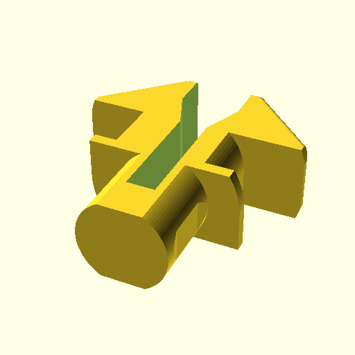

# openscad-rail-slot-mounts
Mount intended for tslot rails (and perhaps vslots later) written in OpenSCAD for easier adjustments

To see what each may look like, you can check the png folder for each design.

This uses makefile to update all the stl of each hooks. And also [docker-openscad](https://github.com/openscad/docker-openscad) as self compiling openscad seems fraught with render errors.

## Contribution welcomed

Pull request will be accepted. Just don't forget to add your name to this page so we can keep track of everyone.

## Folder Structure

* tslot : These will contain designs that can be immediately used on any tslot rail
    - `tslot.scad` : main template module used by all other parts in this folder
* screw : This contains designs that can be mounted on walls via screws, or tslot or vslot rails via rail nuts or screws.
* vslot : This will contain designs that can be immediately used on any vslot rail (To be done)

## T-Slot Profile Nut

## TODO:

* Sync cable hook, paper holder and screwdriver mount to use tslot.scad